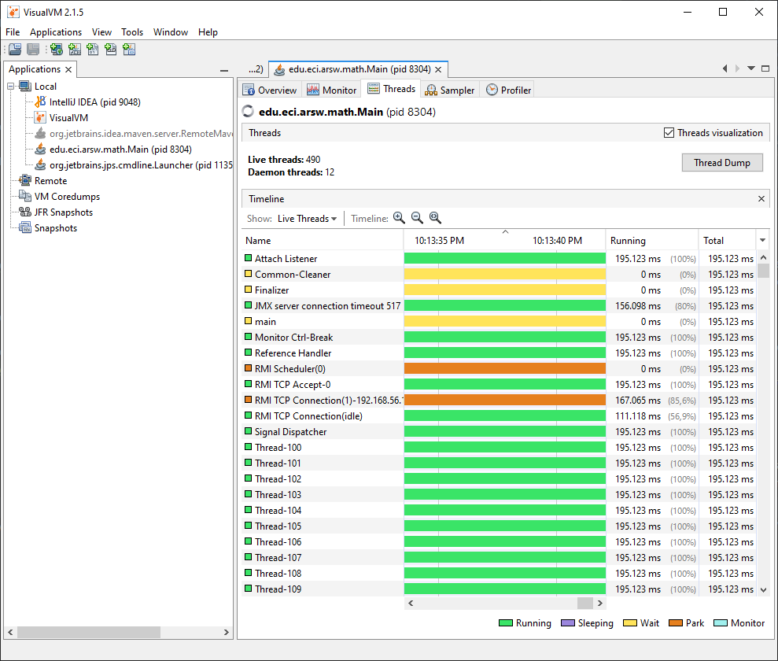

### Escuela Colombiana de Ingeniería
### Arquitecturas de Software
## Introducción al paralelismo - hilos

Entregar: Fuentes y documento PDF con las respuestas.

#### Integrantes: Maria Juanita Oramas y Wilson Delgado

---
**Lecturas Base:**
* http://beginnersbook.com/2013/03/java-threads/ 
* http://cs-fundamentals.com/tech-interview/java/differences-between-thread-and-process-in-java.php

**Descripción:**
En este laboratorio veremos una introducción a la programación con hilos en Java. Entender su comportamiento, dependiendo de su cantidad y el momento de compilación. 
Se puede evidenciar que con la implementación de hilos en Java, permite que un programa sea más eficiente y encuentre en este caso la solución de forma más rápida. 
---
**Parte I Hilos Java**

1. De acuerdo con lo revisado en las lecturas, complete las clases CountThread, para que las mismas definan el ciclo de vida de un hilo que imprima por pantalla los números entre A y B.

2. Complete el método __main__ de la clase CountMainThreads para que:
	1. Cree 3 hilos de tipo CountThread, asignándole al primero el intervalo [0..99], al segundo [99..199], y al tercero [200..299].
	2. Inicie los tres hilos con 'start()'.
	3. Ejecute y revise la salida por pantalla. 
	4. Cambie el inicio con 'start()' por 'run()'. Cómo cambia la salida?, por qué?.

**Cuando se le da con start():**

Cuando implementamos este método se crea un nuevo hilo y se ejecuta el código de run() dentro de esta. 

Por ese motivo la secuencia en la que se imprimen se ve desorganizada dado que se está ejecutando a la vez los hilo sy se mezclan las secuencias.

**Cuando se le da con run():**

Aquí como no se crea ningún Thread nuevo, se ejecutara en el Thread actual, por lo tanto, no se harán hilos multiples.

Se presenta en orden porque se esta ejecutando todo dentro del mismo hilo.

---
**Parte II Hilos Java**

La fórmula [BBP](https://en.wikipedia.org/wiki/Bailey%E2%80%93Borwein%E2%80%93Plouffe_formula) (Bailey–Borwein–Plouffe formula) es un algoritmo que permite calcular el enésimo dígito de PI en base 16, con la particularidad de no necesitar calcular nos n-1 dígitos anteriores. Esta característica permite convertir el problema de calcular un número masivo de dígitos de PI (en base 16) a uno [vergonzosamente paralelo](https://en.wikipedia.org/wiki/Embarrassingly_parallel). En este repositorio encontrará la implementación, junto con un conjunto de pruebas. 

Para este ejercicio se quiere calcular, en el menor tiempo posible, y en una sola máquina (aprovechando las características multi-core de la mismas) al menos el primer millón de dígitos de PI (en base 16). Para esto

1. Cree una clase de tipo Thread que represente el ciclo de vida de un hilo que calcule una parte de los dígitos requeridos.
2. Haga que la función PiDigits.getDigits() reciba como parámetro adicional un valor N, correspondiente al número de hilos entre los que se va a paralelizar la solución. Haga que dicha función espere hasta que los N hilos terminen de resolver el problema para combinar las respuestas y entonces retornar el resultado. Para esto, revise el método [join](https://docs.oracle.com/javase/tutorial/essential/concurrency/join.html) del API de concurrencia de Java.
3. Ajuste las pruebas de JUnit, considerando los casos de usar 1, 2 o 3 hilos (este último para considerar un número impar de hilos!)

Se realizaron las pruebas con 1 hilo:

Se realizaron las pruebas con 2 hilos:

Se realizaron las pruebas con 3 hilos:

---
**Parte III Evaluación de Desempeño**

A partir de lo anterior, implemente la siguiente secuencia de experimentos para calcular el millon de dígitos (hex) de PI, tomando los tiempos de ejecución de los mismos (asegúrese de hacerlos en la misma máquina):

1. Un solo hilo.

2. Tantos hilos como núcleos de procesamiento (haga que el programa determine esto haciendo uso del [API Runtime](https://docs.oracle.com/javase/7/docs/api/java/lang/Runtime.html)).

3. Tantos hilos como el doble de núcleos de procesamiento.

4. 200 hilos.

5. 500 hilos.

Como se realizo la operacion con los siguientes 1'000.000.000 digitos de PI, se puede concluir que con el metodo *join()* se tarda mucho en encontrar estos numeros sin haber antes sincronizado los hilos, dado que con el join la iteracion va uno a uno. 
Y en ambientes tan grandes como este (que maneje tanto hilos al mismo tiempo) se vuelve muy .......

Al iniciar el programa ejecute el monitor jVisualVM, y a medida que corran las pruebas, revise y anote el consumo de CPU y de memoria en cada caso. 

Con la ejecucion de este, con esta cantidad de digitos encontramos que:

-- -- ---------

Con lo anterior, y con los tiempos de ejecución dados, haga una gráfica de tiempo de solución vs. número de hilos. Analice y plantee hipótesis con su compañero para las siguientes preguntas (puede tener en cuenta lo reportado por jVisualVM):

1. Según la [ley de Amdahls](https://www.pugetsystems.com/labs/articles/Estimating-CPU-Performance-using-Amdahls-Law-619/#WhatisAmdahlsLaw?):

	, donde _S(n)_ es el mejoramiento teórico del desempeño, _P_ la fracción paralelizable del algoritmo, y _n_ el número de hilos, a mayor _n_, mayor debería ser dicha mejora. Por qué el mejor desempeño no se logra con los 500 hilos?, cómo se compara este desempeño cuando se usan 200?. 

Esto es porque el procesador en uso no soporta toda esta cantidad de hilos, necesitados para este proceso.

2. Cómo se comporta la solución usando tantos hilos de procesamiento como núcleos comparado con el resultado de usar el doble de éste?.

3. De acuerdo con lo anterior, si para este problema en lugar de 500 hilos en una sola CPU se pudiera usar 1 hilo en cada una de 500 máquinas hipotéticas, la ley de Amdahls se aplicaría mejor?. Si en lugar de esto se usaran c hilos en 500/c máquinas distribuidas (siendo c es el número de núcleos de dichas máquinas), se mejoraría?. Explique su respuesta.

---
#### Criterios de evaluación.

1. Funcionalidad:
	- El problema fue paralelizado (el tiempo de ejecución se reduce y el uso de los núcleos aumenta), y permite parametrizar el número de hilos usados simultáneamente.

2. Diseño:
	- La signatura del método original sólo fue modificada con el parámetro original, y en el mismo debe quedar encapsulado la paralelización e inicio de la solución, y la sincronización de la finalización de la misma.
	- Las nuevas pruebas con sólo UN hilo deben ser exactamente iguales a las originales, variando sólo el parámetro adicional. Se incluyeron pruebas con hilos adicionales, y las mismas pasan.
	- Se plantea un método eficiente para combinar los resultados en el orden correcto (iterar sobre cada resultado NO sera eficiente).

3. Análisis.
	- Se deja evidencia de la realización de los experimentos.
	- Los análisis realizados son consistentes.
